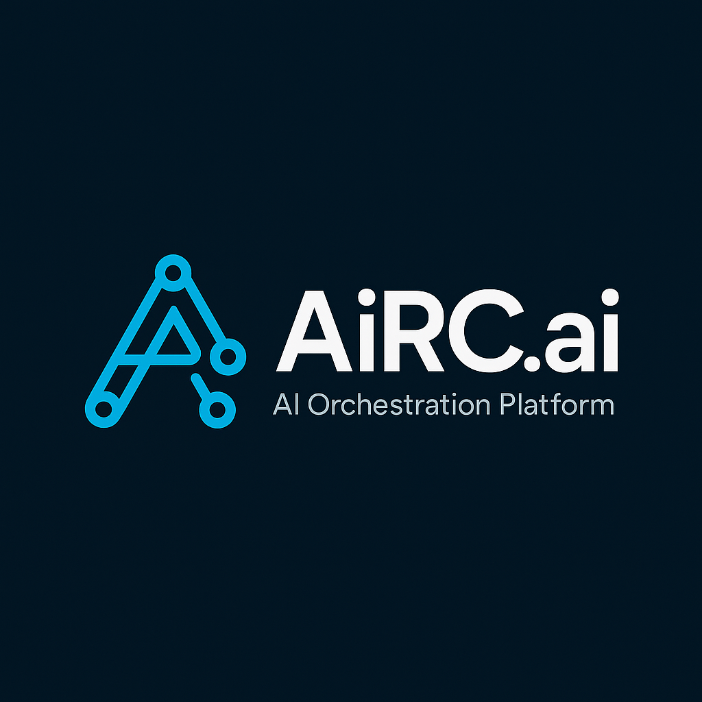
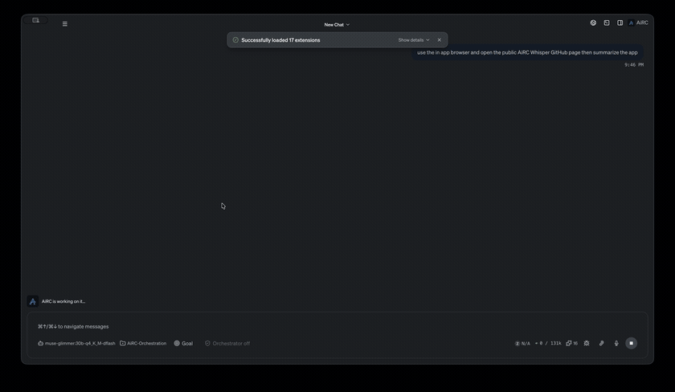
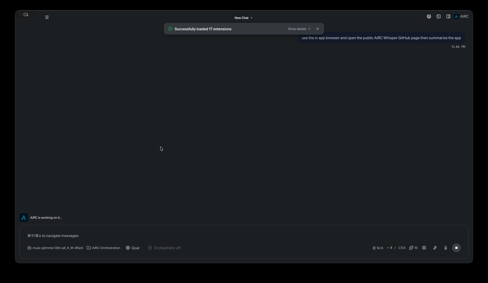
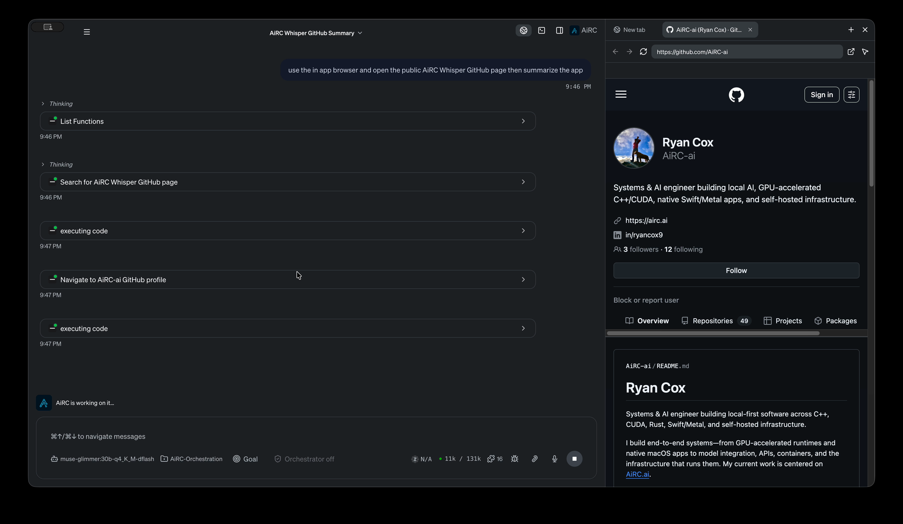
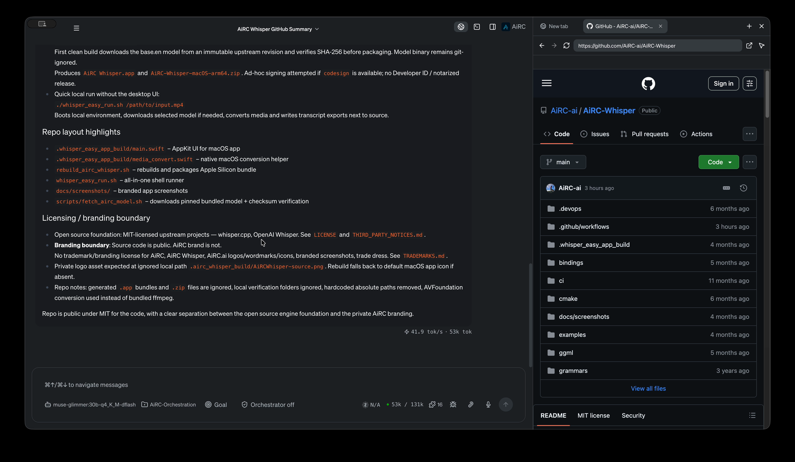

# AiRC Orchestration

  

  <strong>One desktop workspace for AI work that outlasts a single prompt — models, tools, goals, plans, and supervised execution, all tied to your project.</strong>

  
  

  <a href="https://github.com/AiRC-ai/AiRC-Orchestration/releases/latest">Download the latest Beta</a>
  &nbsp;|&nbsp;
  <a href="https://airc.ai/">AiRC.ai</a>
  &nbsp;|&nbsp;
  <a href="SUPPORT.md">Support</a>

> [!IMPORTANT]
> **AiRC Orchestration is proprietary Beta software.** Features, interfaces, integrations, and packaging may change. Download only from this repository's verified [Releases](https://github.com/AiRC-ai/AiRC-Orchestration/releases) page and review the license before use.

Most AI chat tools reset the moment you close the tab. AiRC Orchestration is built for work that takes hours or days — it keeps your project, task, model, tools, goal, plan, and execution evidence connected so an AI workflow can make real progress without losing context.

This repository is the public home for product presentation, release artifacts, installation guides, support, and security reporting. The application source is maintained separately.

## See It In Action

  

  Real Beta session: the <code>muse-glimmer</code> model uses the in-app browser to find, inspect, and summarize the public <a href="https://github.com/AiRC-ai/AiRC-Whisper">AiRC Whisper</a> repository. Every frame was reviewed for private data. <a href="assets/README.md">Capture provenance</a>.

<table>
  <tr>
    <td width="33%"></td>
    <td width="33%"></td>
    <td width="33%"></td>
  </tr>
  <tr>
    <td align="center">One-line browser task</td>
    <td align="center">Live repository inspection</td>
    <td align="center">Detailed architecture summary</td>
  </tr>
</table>

## Why It's Different

### Project-centered work

Tasks, message history, model state, enabled capabilities, and working directory stay tied to the project — no re-explaining context when you come back. Multiple sessions can run concurrently, each with its own model and tool configuration, and the most recent sessions are tracked for quick switching.

### Goals and plans

Give long-running work an explicit objective and track its progress. **Plan Mode** lets the AI explore read-only — reading files, inspecting code, browsing — before making any changes. When the plan is ready, execution begins with the full context already in place.

### Model flexibility

Switch between hosted, local, or remote model providers per session, with model-aware context and reasoning controls. AiRC supports OpenAI-compatible and Anthropic-compatible API formats, with a provider catalog that auto-fills configuration for popular hosted providers. Local inference can run models directly on your machine, and an Inference Mesh mode distributes work across peer nodes.

### Four approval modes

Control how much autonomy the AI has on a per-session basis:

| Mode | Behavior |
| --- | --- |
| **Auto** | Tool calls execute automatically — best for trusted, fast workflows |
| **Smart Approve** | Only sensitive tool calls prompt for approval — the balance point |
| **Approve** | Every tool call asks before executing — full control |
| **Chat** | No tool calls — pure conversation |

### Composable capabilities

Combine tools, extensions, skills, recipes, apps, and automations instead of being locked into one chat surface:

- **Extensions** — MCP-compatible tool servers that add capabilities (file system, shell, browser, databases, APIs)
- **Skills** — Loaded from `SKILL.md` files; extend AiRC with domain-specific instructions
- **Recipes** — Shareable, parameterized workflows encoded as deep links (`airc://recipe?config=...`)
- **Apps** — Applications built by AiRC through chat or imported from shared packages; appear in a grid and launch standalone
- **Automations** — One-time or recurring scheduled work with project and model context attached, managed from plain language

### Supervised execution

Use the optional **Orchestrator** layer to start, monitor, message, and interrupt agent sessions while the main task stays coordinated. The Orchestrator can list active sessions, view their state, send messages to them, and interrupt them — all from within the main chat.

### Bounded delegation

Send focused work to subagents with scoped providers, models, and tools — the main task stays in control. Delegated subagent sessions appear inline with their tool calls and results, and you can jump directly into a subagent's session to inspect what happened.

### Natural-language automation

Create and manage one-time or recurring work from plain-language instructions, with project and model context attached. Automations support cron scheduling, pausing, resuming, and manual run-now. Each run creates a session you can inspect afterward.

### Integrated work surfaces

Use development tools, terminal workflows, browser work, and computer control where enabled and explicitly permitted:

- **Developer tools** — File editing, shell execution, code analysis
- **In-app browser** — Open and inspect web pages directly inside AiRC
- **Computer control** — Platform-level automation (macOS, Linux, Windows) for screen, input, and document workflows
- **Tunnel access** — Securely connect to AiRC from a mobile device through an encrypted tunnel

### Voice and dictation

Speak instead of type. AiRC supports dictation through multiple providers — OpenAI, ElevenLabs, Groq, and fully local on-device models — with downloadable model management.

Availability depends on the selected model, provider, operating system, configured capabilities, and permissions granted by the user.

## Download The Beta

The current Beta release is **1.45.0+airc49**. Each installer ships with verification files on the [Releases](https://github.com/AiRC-ai/AiRC-Orchestration/releases) page.

This release closes a multi-window activation race in global Orchestrator and live-extension settings. Tasks that are opening, resuming, forking, or beginning work now participate in one serialized topology, so every window converges on the same final settings without duplicate agents, missing extensions, stale review ownership, or blocked long-conversation replay. It also retains the durable task identifiers, stale-route recovery, long-session loading, Computer Use, provider metadata, context reporting, and complete AiRC branding from the preceding 1.45 builds. See the [full release notes](https://github.com/AiRC-ai/AiRC-Orchestration/releases/tag/v1.45.0%2Bairc49) for verification and installation details.

| Platform | Architecture | Download |
| --- | --- | --- |
| macOS | Apple silicon (`arm64`) | [`AiRC-1.45.0+airc49-macOS-arm64.zip`](https://github.com/AiRC-ai/AiRC-Orchestration/releases/download/v1.45.0%2Bairc49/AiRC-1.45.0+airc49-macOS-arm64.zip) |
| Debian-family Linux | x86_64 (`amd64`) | [`airc_1.45.0+airc49_amd64.deb`](https://github.com/AiRC-ai/AiRC-Orchestration/releases/download/v1.45.0%2Bairc49/airc_1.45.0+airc49_amd64.deb) |

The macOS build is signed with a Developer ID certificate, notarized by Apple, and carries a stapled notarization ticket — Gatekeeper accepts it without warnings.

Every release includes `SHA256SUMS`, a machine-readable `release-manifest.json`, the AiRC license, the retained Apache license, and third-party notices. See [Installation](docs/INSTALL.md) and [Verify a download](docs/VERIFY.md) before first use.

## How Releases Are Verified

No installer is published until it passes the repository's release gates:

- macOS signing, notarization, stapling, and Gatekeeper acceptance
- Debian package metadata and architecture verification
- version, file-name, checksum, and manifest consistency
- clean-install, launch, branding, and upgrade checks
- inspection for private source, credentials, logs, user data, and internal build artifacts

Maintainer details are in [Publishing a release](docs/PUBLISHING.md).

## Using The Beta Responsibly

The macOS build carries a valid Developer ID signature, an Apple notarization ticket, and passes Gatekeeper without warnings. The Debian package is architecture-verified with matching checksums. Download only from this repository's [Releases](https://github.com/AiRC-ai/AiRC-Orchestration/releases) page — do not install packages offered elsewhere.

- Review model, tool, extension, automation, and operating-system permissions before use.
- Keep approval controls at the narrowest practical level for consequential actions.
- Treat browser and computer-control capabilities as privileged — enable them only when needed.
- Keep important work backed up; Beta interfaces and migration behavior may change.
- Never post diagnostics publicly without removing messages, configuration, credentials, private URLs, and personal data.

## Support And Security

- **Product or Beta-testing issues** — read [Support](SUPPORT.md) and open an issue.
- **Security vulnerabilities** — follow [Security](SECURITY.md). Do not disclose a vulnerability in a public issue.
- **Product information** — visit [airc.ai](https://airc.ai/).

## License

Original AiRC software, modifications, documentation, release tooling, artwork, and branding are proprietary and governed by the [AiRC Orchestration Proprietary Beta License](LICENSE). Inherited open-source and third-party components retain their respective licenses and notices. See the [license map](LICENSES.md), [NOTICE](NOTICE), [Apache License 2.0](licenses/Apache-2.0.txt), and [third-party notices](THIRD_PARTY_NOTICES.md).
